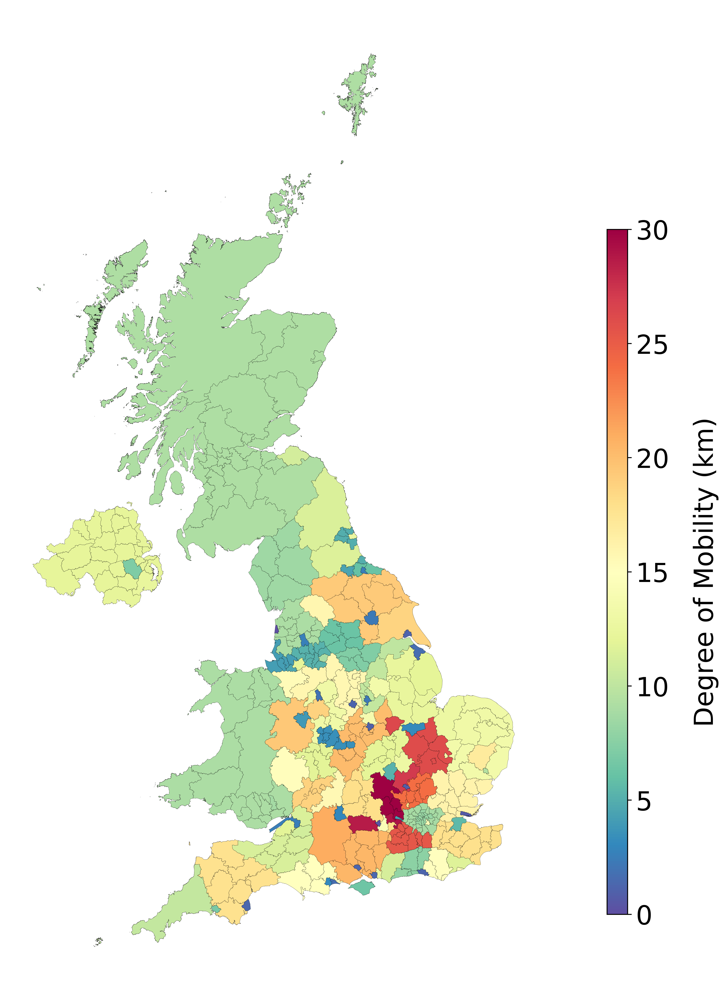
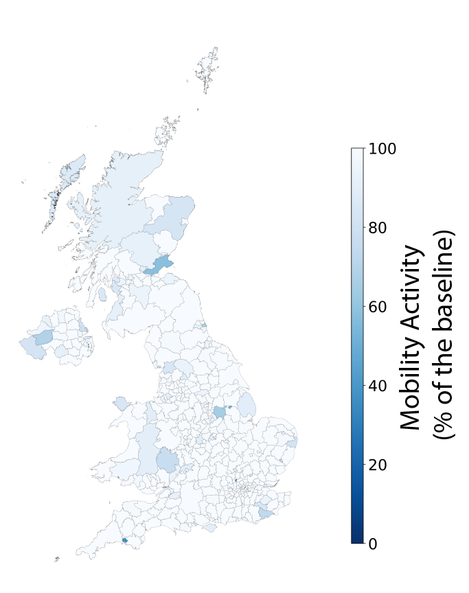
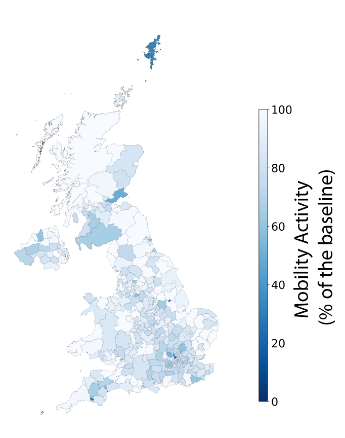
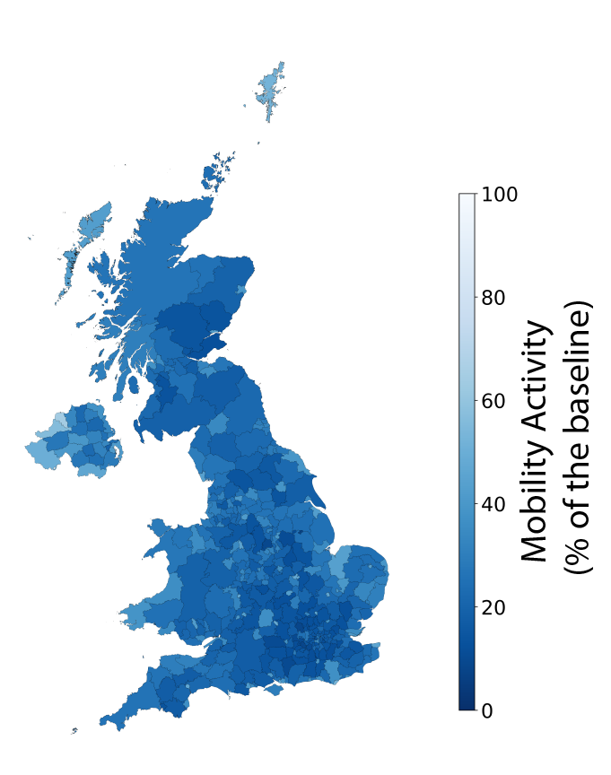
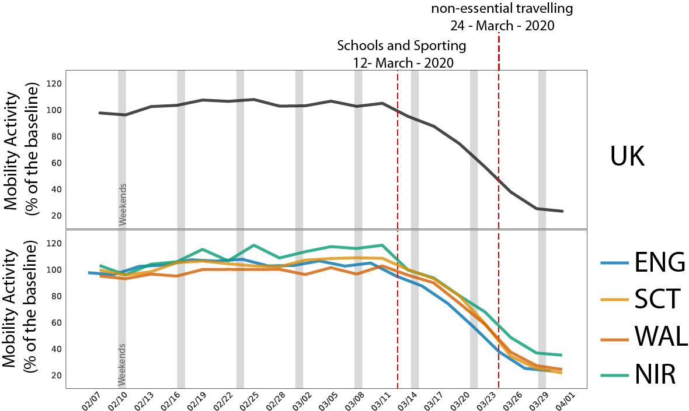
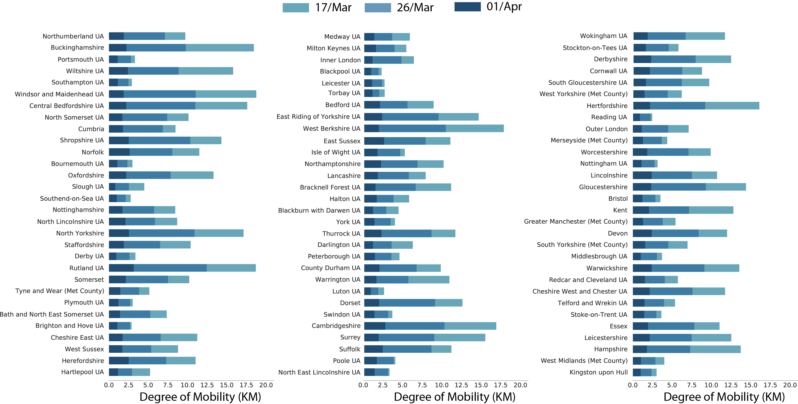
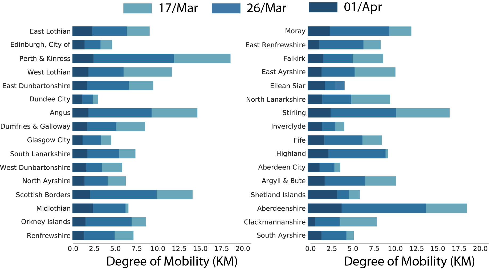
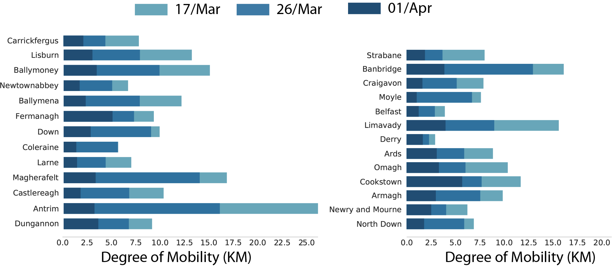
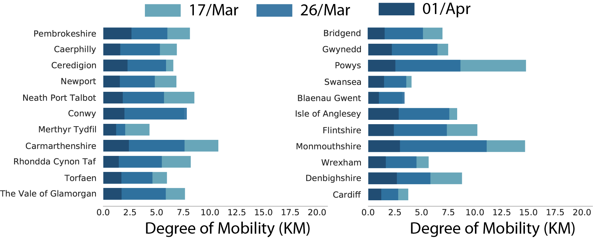
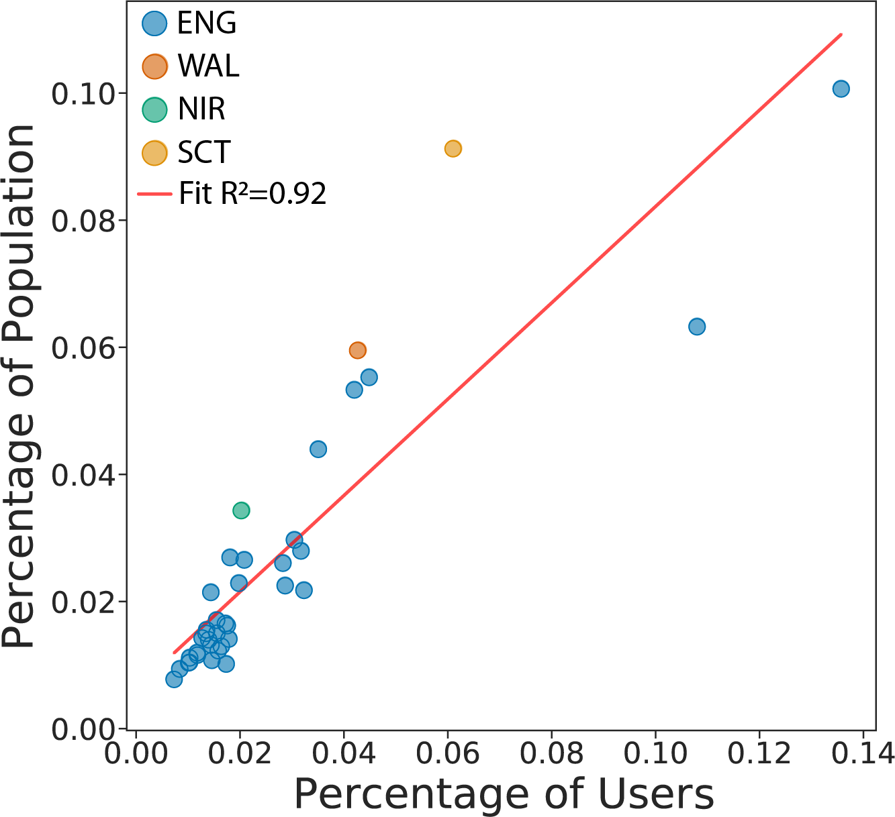

---

description: "First report (8th April 2020): analysis of human mobility in the UK during the COVID-19 pandemic"

---

Authors:
**Clodomir Santana (1), Federico Botta (1), Hugo Barbosa (1), Filippo Privitera (2), Ronaldo Menezes (1) and Riccardo Di Clemente (1).**

(1) Department of Computer Science, University of Exeter.
 
(2) Cuebiq Inc.

[Go back to home page](./index.html).
 
 
<a href="reports/Covid19_UK.pdf" download>Click here to download the report.</a> 

### Disclaimer

These results/analyses do not necessarily reflect the views of the University of Exeter and it is not an official position of the University. The analyses here reflect the personal views of the aforementioned researchers. The reader should also be aware that, although we have used all tools necessary to ensure the correctness of our analyses, this work has not been independently peer-reviewed. We welcome your feedback on our analyses and methodology.

## Executive summary
 
Our aim is to assess the effects of the COVID-19 restriction measures on the mobility patterns of people in the UK. These measures are strong public health policies which came into place as a consequence of the COVID-19 pandemic and its potential impact on the British population and on the NHS. To do so, we analyse changes in the average levels of mobility of anonymous mobile phone users across the country at different time periods, which include the periods when the restriction measures are in place and enforced by authorities.
 
#### Summary of main initial findings
   * In early March, before restriction measures were enforced, mobility levels decreased by about 10% compared to their normal levels before the pandemic.
   
   * In the middle of March, after people were encouraged to work from home and reduce their travelling, mobility levels dropped by about 50% compared to before the pandemic.
   
   * From March 24th onwards the UK entered a state of lockdown, with only essential travelling allowed. This led to a reduction of about 70% in the mobility levels.
   
   * Mobility levels have dropped consistently in all areas across the UK after the lockdown measurements.

These results present our initial analysis of the restriction measures and their effect on mobility across the UK. This might be of interest to epidemiologist who can use this to estimate contact matrices, and to public health policy makers who have to assess the impact of their policies on the British population.
 

## Timeline of COVID-19 development in the UK
In January 2020, cases of the novel coronavirus started being reported outside of China. These cases were typically from people who had recently travelled to the Chinese Hubei province, where the disease started spreading. Events related to COVID-19 in the UK started unfolding at the end of January, with the first reported cases in the country. A brief timeline for the UK is the following:
   * <b>31st January 2020</b>: two Chinese nationals, one of whom studied at the University of York, were the first confirmed cases in the UK.
   * <b>6th February 2020</b>: a man in Brighton became the third confirmed case in the UK. He had previously travelled to Singapore and then visited a ski resort in France.
   * <b>10th February 2020</b>: the number of confirmed cases in the UK increases to 10, due to infections linked to the man in Brighton.
   * <b>27th February 2020</b>: the total number of confirmed cases is 16, with the first sign of infections spreading from the outbreak in Northern Italy due to people travelling back from the affected regions.
   * <b>1st March 2020</b>: the official number of cases is 36, and there are signs of infections amongst people with no history of recent travel abroad.
   * <b>11th March 2020</b>: the confirmed cases in the UK are now 456. The World Health Organisation declares the outbreak a pandemic.
   * <b>12th March 2020</b>: the UK Chief Medical Office raises the risk from moderate to high. Anyone with a new continuous cough or a fever is recommended to self-isolate for seven days, schools cancel trips abroad and people over 70 are asked to avoid cruises.
   * <b>13th March 2020</b>: many sporting events are postponed, as well as the 2020 UK local elections.
   * <b>16th March 2020</b>: the number of cases is over 1,500, and the number of deaths is 55. The Prime Minister advises against non essential travelling, and encourages people to avoid pubs, clubs and theatres. Working from home is encouraged.
   * <b>23rd March 2020</b>: the Prime Minister announces stricter measures for the UK coming into place from the following day (March 24th). People are asked to stay home except for essential food shopping, essential work travel and one form of exercise per day only with members of their household.
   * <b>26th March 2020</b>: the death toll is 422, and the number of people that tested positive is 11,568.
   * <b>27th March 2020</b>: both the Prime Minister and the Health Secretary announce testing positive for the virus.

Note that this timeline is not meant to be complete, but is only an indication of how major events related to COVID-19 unfolded in the UK over time, and which restrictions were put into place at what point in time. For a more complete report on the development of COVID-19 in the UK, you can <a href="https://en.wikipedia.org/wiki/2020_coronavirus_pandemic_in_the_United_Kingdom" target = "_blank" rel = "no opener no referrer">read more here</a>. 

## The Analysis

### Baseline February 2020

A key indicator to evaluate the effectiveness of these restrictions and assess the compliance of the population is the reduction in mobility. Here, we will use a large, national-scale data set on human mobility, provided by the collaboration with Cuebiq, to evaluate the adherence to these measures by the general population.

These reports are based on similar analysis carried on Italian data 
<a href="https://doi.org/10.1101/2020.03.22.20039933"> Pepe E. et al. 2020 </a>  and US data
 <a href="https://www.mobs-lab.org/uploads/6/7/8/7/6787877/assessing_mobility_changes_in_the_united_states_during_the_covid_19_outbreak.pdf"> Klein B. et al. 2020</a>. We aim to provide and assess the changes in commuting and mobility at local authority level across UK during the Covid-19 health crisis.

In order to assess whether movement of people has reduced in the UK during the restriction measures, we first have to establish what the regular level of movement across country is. We refer to this as our baseline. We use the <em> radius of gyration </em> as our measure of mobility. The radius of gyration provides an indication of the characteristic distance travelled by a person during a given time period.
 
We estimate our baseline by considering the average mobility during the period between 01 and 04 of February 2020. This period is immediately before restriction measures were put into place by the British government, and it does not contain significant events, such as bank holidays or festivities, that may affect our baseline estimates. For our baseline, we use the median radius of gyration. <b>Figure 1 (A)</b> depicts the results of our baseline estimates at local authority level.
 
As an example of a comparison between the baseline and another day, we selected the 22th of February and showed the comparison result in <b>Figure 1 (B)</b>. As the Figure shows, on an average day only few areas within the UK present a lower radius of gyration when compared to the baseline. This supports the validity of our baseline estimate, since on an average day we would not expect the radius of gyration to be very different from the baseline (note that there will always be a few areas with higher or lower mobility levels).

 
<figure class="image" align="center">

 <figcaption align="center"> <b>Figure 1</b> (A) We estimate the average levels of mobility across the UK to use as comparison throughout our analysis. As a measure of mobility, we use the radius of gyration, which indicates the typical distance travelled during the given time period. Here, we depict the median radius of gyration during the time period between 01 and 04 of February 2020. Areas with more intense red correspond to areas with a larger value of the radius of gyration.</figcaption>
</figure>

<figure class="image" align="center">

 <figcaption align="center"> <b>Figure 1</b>(B) We validate our baseline by comparing it to a typical day (22th February 2020) before the restriction measures came into place. Blue areas represent locations where the radius of gyration decreased, whereas grey areas represent no changes or an increase in the mobility. We find that, on a typical day, we do not observe many areas where the radius of gyration is lower than our baseline.</figcaption>
</figure>

### Changes in mobility 

We want to assess the changes in the levels of mobility in the UK during the Covid-19 pandemic. We compare the weekly levels of mobility to our baseline, and we present the results as a percentage of the baseline. We refer to this as the mobility activity. For instance, if the mobility activity has a value of 50, this corresponds to a mobility level which is 50% lower when compared to our baseline. In the animation below, we show how the mobility has been changing since the beginning of February. We can see that, until early March, the mobility activity was remaining roughly constant, but it starts to drop sharply soon after the first restriction measures have been put into place.

<figure class="image" align="center">

<figcaption align="center"> <b>Evolution of mobility activity over the period of our analysis.</b></figcaption>
</figure>

### 16th March 2020

By March 16th 2020, the confirmed number of Covid-19 cases in the UK had increased to about five hundred  and the Chief Medical Officer advised schools to cancel school trips and recommended people with coronavirus symptoms (fever of dry continuous cough) to self isolate for seven days. <b>Figure 2</b> depicts the comparison between this day and the baseline. Visual inspection clearly reveals several areas which have a decreased radius of gyration, as compared to Figure 1 (B). However, the majority of locations still presents no decrease in the average mobility. 
 
<figure class="image" align="center">

<figcaption align="center"> <b>Figure 2</b> We compare the average mobility on March 17th 2020 with our baseline estimates. We find that a number of locations present a mobility of about 10% less than the baseline, as measured by the radius of gyration. However, the majority of areas still exhibit no decrease.</figcaption>
</figure>

### 26 March 2020

On March 23rd 2020, the Prime Minister asked the British people to stop all non-essential travelling, effectively imposing a state of lockdown in the UK starting on March 24th. We anticipate that this restriction measure will lead to a big reduction in the levels of mobility in the upcoming days. We analyse the mobility activity two days after the lockdown started to investigate the impact of this measure. <b>Figure 3</b> presents the changes in the radius of gyration between March 26th and our baseline. We clearly see a reduction in the mobility of people across the majority of the UK. We also note that the reduction is broadly similar across the whole country.
 
<figure class="image" align="center">

<figcaption align="center"> <b>Figure 3</b> Here, we present a comparison between the radius of gyration across the UK on 26th March and the baseline mobility levels. We observe a reduction in the average mobility of about 70% compared to the baseline for most of the UK as a result of restriction measures put into place by the Government.</figcaption>
</figure>

### 01 April 2020

We anticipate that the restriction measures on people's mobility imposed by the British Government will take a few days to show their full effect. Here, we compare the median radius of gyration on April 1st with our baseline (<b> Figure 4</b>). We find a reduction in mobility across the majority of the United Kingdom.
 
<figure class="image" align="center">

<figcaption align="center"> <b>Figure 4</b> Here, we present a comparison between the radius of gyration across the UK on April 1st and the baseline mobility levels. We observe a reduction in the average mobility of about 80% compared to the baseline for most of the UK as a result of restriction measures put into place by the Government.</figcaption>
</figure>

### The Trend of UK

Here, we consider the overall trend over time across the UK. We find a clear drop in mobility activity roughly starting on the first weekend of March, a few days before the first restriction measures were put into place. We find that the reduction is consistent across England, Wales, Scotland, and Northern Ireland.

 
<figure class="image" align="center">

<figcaption align="center"> <b>Figure 5</b> We depict here the evolution over time of the mobility activity for the UK, England, Scotland, Wales, and Northern Ireland. We find that the mobility starts decreasing in early March, and sharply drops around the second part of the month by about 80% compared to the baseline. </figcaption>
</figure>

### Comparing mobility activity before and after the restriction measures

Our goal is to assess whether restriction measures are having the desired effect in reducing the mobility of British people. Here, we directly compare the degree of mobility in different time periods across the four countries in the United Kingdom. After March 23rd, when an effective lockdown was imposed on the country, we see a great reduction in the levels of mobility across all of the UK.
 

<figure class="image" align="center">

<figcaption align="center"> <b>Figure 6 UK</b></figcaption>
</figure>
 

### Detailed mobilty trend in England
<figure class="image" align="center">

<figcaption align="center"></figcaption>
</figure>
 

### Detailed mobilty trend in Scotland
<figure class="image" align="center">

<figcaption align="center"> </figcaption>
</figure>
 

### Detailed mobilty trend in Norther Ireland
<figure class="image" align="center">

<figcaption align="center"> </figcaption>
</figure>
 

### Detailed mobilty trend in Wales
<figure class="image" align="center">

<figcaption align="center"></figcaption>
</figure>

### Validation of Data

We want to assess the validity of our data in terms of how representative our sample is. Here, we compare the percentage of the population in each area against the percentage of the number of users. We find a high correlation in our dataset with an R2 of 0.92. Please note that the two points in the top right correspond to areas in London. 
<figure class="image" align="center">

</figure>

## Data & Methods

This research has been performed using data from anonymized users who have opted-in to provide access to their location data anonymously, through a GDPR-compliant framework. The single users were not identifiable at any research steps. The residential areas were inferred at an aggregated local authority level. The analysis has been performed on a sample 250K users across the UK. We performed the radius of gyration analysis using the definition of (<a href="https://doi.org/10.1038/nature06958">Gonzalez, M. et al Nature 2008</a>). Moreover, each mobility value of a given region is the median value of the distribution of the radius of gyration of the users within a temporal window over the following 8 days.

## Team

<a href="http://emps.exeter.ac.uk/computer-science/"> University of Exeter, Department of Computer Science: </a> team members from the Department of Computer Science have expertise in human mobility, data science, human behaviour and urban science (see disclaimer above).

<a href="https://www.cuebiq.com/"> Cuebiq Inc.</a> is a consumer insights company that analyzes visitation patterns based on aggregated and privacy-enhanced mobility data, to provide measurement, support academic research and humanitarian initiatives.

## Contact us

If you have any questions, comments or would like to know more about our analysis, you can contact us at the following email addresses:
 
<a href = "mailto: r.di-clemente@exeter.ac.uk"> Riccardo Di Clemente</a>, Exeter University
 
<a href = "mailto: blake@cuebiq.com"> Brennan Lake</a>, Cuebiq Inc.

## Acknowledgments
This preliminary analysis is a collaboration between the Department of Computer Science of University of Exeter and Cuebiq Inc. In response to the COVID-19 crisis, <a href= "https://www.cuebiq.com/">Cuebiq</a> is providing insights to academic and humanitarian groups through a multi-stakeholder <a href="https://www.cuebiq.com/about/data-for-good/"> data collaborative</a> for timely and ethical analysis of aggregate human mobility patterns. We thank Pietro Gravino for the useful discussions.

