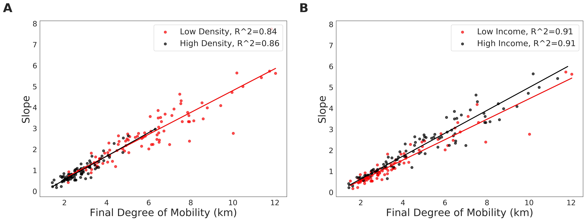
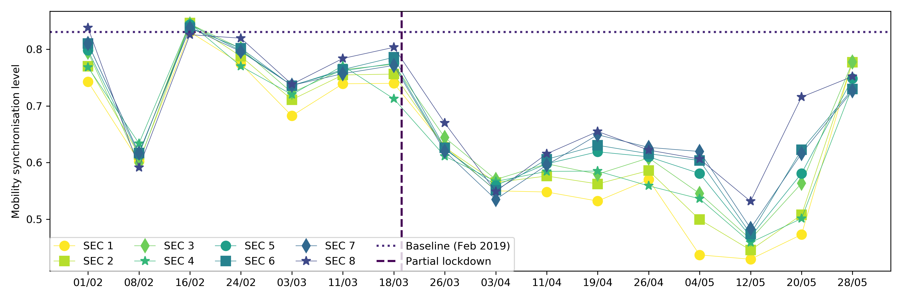

---

description: "Second report (4th June 2020): analysis of socioeconomic aspects related to mobility patterns in the UK during the COVID-19 pandemic"

---

Authors:
**Clodomir Santana (1), Federico Botta (1), Hugo Barbosa (1), Filippo Privitera (2), Ronaldo Menezes (1) and Riccardo Di Clemente (1).**

(1) Department of Computer Science, University of Exeter.
 
(2) Cuebiq Inc.

[Go back to home page](./index.html).

<a href="reports/Covid19_Second_UK.pdf" download>Click here to download the report.</a>

### Disclaimer

These results/analyses do not necessarily reflect the views of the University of Exeter and it is not an official position of the University. The analyses here reflect the personal views of the aforementioned researchers. The reader should also be aware that, although we have used all tools necessary to ensure the correctness of our analyses, this work has not been independently peer-reviewed. We welcome your feedback on our analyses and methodology.

## Executive summary

Lockdown measures put in place around the world have affected people's lives at various levels. The debate about when they should start and end is endless, with many defending variations of it which consider age, health risk, the importance of labour for society (key workers), to name a few. In certain locations in the world, particularly in developing nations, the debate is between health issues (lockdown) vs. survivability (getting back to work); this debate is around health concerns and the economy and one that is hard to delve into. 

In line with the worries about the economy, a few world leaders have defended what is called vertical social isolation to "enable people in low income classes to earn a living" and "avoid further suffering from loss of income"[<a href="https://www.wsws.org/en/articles/2020/04/27/bols-a27.html">1</a>,<a href="https://riotimesonline.com/brazil-news/brazil/bolsonaro-to-call-on-mandetta-to-isolate-only-the-elderly-and-sick/">2</a>,<a href="https://eu.freep.com/story/news/local/michigan/2020/05/21/donald-trump-ford-motor-restart-american-economy/5239965002/">3</a>]. Although these policies have not been in place in the UK we explore what has been the <em>de facto</em> effect of lockdown policies to different social classes in several regions of the UK. 

### Summary of main findings

In this report, we show that low-income groups have never attained the same level of restrictions as high-income groups in the UK. This means that social isolation policies disproportionately affect different groups, with high-income groups being the most able to restrict their movement. We focused the analysis on four periods depicted in Figure 2, henceforth called <strong>P1</strong> (from 11/3/2020 to 23/3/2020), <strong>P2</strong> (from 23/3/2020 to 5/4/2020), <strong>P3</strong> (from 5/4/2020 to 17/4/2020) and <strong>P4</strong> (from 10/05/2020 to 22/05/2020). We kept the length of the periods roughly the same to ensure fairness in the analysis. We use these 4 periods to contrast the level of movement restriction for different social classes in a period before the announcement of the UK partial lockdown (P1), the period after the announcement until movement levels started to stabilise around the date of the historic TV broadcast from Queen Elizabeth II (P2), the period after the broadcast until 17 of April (P3), and the more recent period when some restriction measures have been slowly lifted (P4)[<a href="https://en.wikipedia.org/wiki/Timeline_of_the_COVID-19_pandemic_in_the_United_Kingdom">4</a>]. We show that P3 shows an increase in the levels of mobility for lower classes which may be a sign of people getting tired of lockdown restrictions, venturing outside their homes, or even being required to work to provide for their families. The increase in mobility varies significantly around the UK. Lastly, we show that normal rhythms of individuals which arise from our daily routines are completely lost after the suggestion that people should "avoid crowded places and work from home if possible" (17/3/2020); this means that such measures lead to people having variety in their rhythms or even not having regular rhythms.

 
<figure class="image" align="center">

<figcaption align="center"> <strong>Figure 1</strong> 
<em>Evolution of the mobility activity in the UK, ENG, NIR, SCT and WAL since the announcement of the partial lockdown in 23rd of March.</em>

</figcaption>
</figure>
 

### General Information and Methods

In order to measure the effectiveness of the mobility restrictions and assess the compliance of the population, as in our first report[<a href="https://covid19-uk-mobility.github.io/First-report.html">5</a>], we used a national-scale data set on human mobility, provided by the collaboration with Cuebiq. Our goal is to provide and assess the changes in commuting and mobility at the local authority level across the UK during the COVID-19 health crisis.

To analyse whether the movement of people has reduced in the UK during the mobility restriction measures, we established what the regular level of movement across the country (the baseline) is by considering the average mobility during the period between 01 and 04 of February 2020. This period is before restriction measures were announced by the British government, and does not contain significant events, such as bank holidays or festivities, that could affect our baseline estimates.

 As our measure of mobility, we employed the radius of gyration[<a href="http://www.nature.com/articles/nature06958">6</a>] which provides an indication of the characteristic distance travelled by a person during a given time period. To define our baseline, we applied the median radius of gyration in the period aforementioned. For simplification purposes, from now on we will use the term “degree of mobility” instead of "radius of gyration". <strong>Figure 2</strong> depicts the evolution of the degree of mobility in the UK. In <strong>Figure 2</strong>, the Mobility Activity represents the percentage of user mobility with respect to the baseline; a value of 100% indicates that the mobility is the same as the baseline, whereas lower values of mobility activity represent a reduction in the mobility in that area. Values higher than 100% are not reported since they are not one of interest for this analysis.

As indicated earlier, this report focuses on variations in human mobility as a function of socioeconomic status but also looking at specific periods in the last two months of the pandemic. <strong>Figure 2</strong> gives us a general overview of mobility patterns for the entire UK. This general view demonstrates a clear change in patterns which we explored in our First Report[<a href="https://covid19-uk-mobility.github.io/First-report.html">5</a>]. Yet, this figure also shows us a stabilisation in the mobility restrictions and an increase starting in P3. However, the figure does not show how each different socioeconomic group compares to these general patterns, that is, do lock-down restrictions affect (or are implemented by) socioeconomic groups differently?

 
<figure class="image" align="center">

<figcaption align="center"> <strong>Figure 2</strong> 
<em>Updated evolution of the mobility activity over time for the UK compared to the baseline (average mobility between 1st and 4th February 2020). We divided the series into 3 periods: the first one (P1) is highlighted in blue and goes from 11 of March until the day where the partial lockdown was announced in the UK (23rd March). The second period (P2), represented in yellow, starts when the partial lockdown was announced and finished when the mobility activity levels begin to stabilise (5th of April). The penultimate period (green region of the plot) is defined between 5th and 17th of April. In P3, we noticed an increase in mobility activity in some regions of the UK. Finally, the last period (P4) represented by the colour red confirms the increase the mobility activity from 10 to 22 of May 2020. The important dates here are roughly the same ones used in Figure 5 in First Report. However, here we wanted to ensure the lengths of P1, P2, P3 and P4 are the same.</em>
</figcaption>
</figure>
 

Coupled with <strong>Figure 2</strong>, we can see in <strong>Figure 3</strong> that we indeed have an increase in mobility levels in the UK from P2 to P3 but also individually in all countries within the UK except for Northern Ireland. It also shows an increase in the degree of mobility in the UK and all of its four countries in the fourth period.

 
<figure class="image" align="center">

<figcaption align="center"> <strong>Figure 3</strong> 
<em>Comparison between the mobility levels on the end of the fist (23th of March), second (5th of April), third (17 of April) and fourth (22 of May) periods in the UK, England, Northern Ireland, Scotland and Wales. As observed, in most of the regions there was an increase in the mobility activity in P3 and P4.</em>

</figcaption>
</figure>
 

We used an analysis based on the speed at which mobility patterns have changed by looking at individual locations (at the local authority level) at the beginning and end of each period and calculating the slope of the line segment that links the two positions. <strong>Figure 4</strong> shows how this is done. In summary, the larger the degree of change in mobility, the steeper the line segment. We have 3 basic cases shown in figures <strong>4(A)</strong>, <strong>4(B)</strong> and <strong>4(C)</strong> representing an increase of mobility levels, no change, and a decrease, respectively. After doing this, each location has a slope associated with it for each of the four periods.

 
<figure class="image" align="center">

<figcaption align="center"> <strong>Figure 4</strong> 
<em>To estimate the direction and magnitude of the levels of degree of mobility in a period, the following approach was adopted: for each period, we used a linear regression model to find a line which connects the point that represents the degree of mobility at the start of the period to the point at the end of the period. The magnitude of the slope of this line will indicate how big was the difference while the sign tells if it was a reduction (negative) or an increase (positive) in the mobility levels. <strong>Figure 4(A)</strong> shows a scenario of increasing mobility (slope > 0) and Figure <strong>Figure 4(C)</strong> depicts the opposite case (slope < 0). A slope value close to zero, Figure <strong>Figure 4(B)</strong>, indicates a small difference in the degree of mobility between the points considered.</em>

</figcaption>
</figure>
 

### First Period: from 11 to 23 of March 2020

This is the period during which people in the UK were being told to stay at home and avoid all but essential trips. <strong>Figure 5(A)</strong> looks at local authorities with high density (density greater or equal to 1033.0 hab/km²) versus low density (less than 1033.0 hab/km²); the figure indicates that the <em>stay at home</em> message had a different effect in high and low-density local authorities. Locations with high density tend to have a small degree of mobility but from these,  local authorities with a higher degree of mobility had a higher degree of change (slope). For the case of low density areas, we see a milder effect and a wider diversity of degree of mobility; even at the end of the period some locations still have a high degree of mobility despite the significant decreases (slope).

<strong>Figure 5(B)</strong> looks at the changes in mobility based on the total annual household income in 2018 in each of the local authorities. The locations were divided into two groups: one with the local authorities with annual household income less than £43,500 (low-income group) and another composed of local authorities with an annual household income greater or equal to £43,500 (high-income group). During this first period, we see that both low and high-income groups reduced their mobility and as expected the reduction happened at all levels of mobility from areas with low mobility to areas with high mobility. However, it is striking that this figure consistently shows that low-income local authorities did not reduce their mobility at the same level as similar areas of high income.

 
<figure class="image" align="center">

<figcaption align="center"> <strong>Figure 5</strong> 
<em>Analysis of the impact that population density (A) and annual income (B) of local authorities in the UK have on the slope of the line and the degree of mobility at the end of the period. The groups represented by the green and yellow colours were obtained with the division of the data into two equal-sized groups based on sample quantiles. The lines are the output of linear regression for its respective group (colour). These plots show that the reduction in mobility was greater in areas with low density and the ones with high income.</em>

</figcaption>
</figure>
 

With the results depicted in <strong>Figure 6</strong>, we wanted to have a better understanding of how important the population density and the annual income are to the results presented in <strong>Figure 5</strong>. <strong>Figure 6(A)</strong> looks at how the annual household income and the population density are associated with the final degree of mobility in each local authority. As can be seen in <strong>Figure 6(A)</strong>, the variation in the final degree of mobility is more related to the population density than to the income. This might be due to the fact that in a low-density area, such as rural areas, people tend to have a longer trajectory to work/study when compared to a high-density area such as cities.

<strong>Figure 6(B)</strong> shows how the annual household income and the population density are associated with the slope (how large was the reduction in the mobility). As observed in <strong>Figure 6(B)</strong>, both the annual household income and the population density of the local authorities influence the slope of the line. Also, the plot shows that the larger slopes were generally related to areas with high income and high density.

 
<figure class="image" align="center">

<figcaption align="center"> <strong>Figure 6</strong> 
<em>In this analysis, we wanted to have a better understanding of how important the population density and the annual income are to the results achieved in terms of the slope and the final degree of mobility. The contours represent the bi-variate kernel estimate of the data and both axes are in a logarithm scale for better visualisation.</em>

</figcaption>
</figure>
 

### Second Period: from 23 of March to 05 of April 2020

The second period of our analysis contains the peak of the lockdown and probably the time in which the government invested the most in convincing the population to stay at home. There were numerous campaigns from all walks of society to incentivise people to stay safe and protect the NHS. This was the period in which we also had the television address by Queen Elizabeth II. In this period, depicted in <strong>Figure 7(A)</strong>, we see high-density areas not reducing their degree of mobility much. This is probably due to the fact that their degree of mobility was already small. Conversely, the low-density areas have a more diverse set of change in mobility diversity. The income analyses continue to show a decrease in mobility but again high-income regions consistently have a stronger decrease in mobility (<strong>Figure 7(B)</strong>).

 
<figure class="image" align="center">

<figcaption align="center"> <strong>Figure 7</strong> 
<em>In the second period assessed, we observed similar results to the previous period where we can see a reduction in the degree of mobility in both groups of income and population density; however, it is worth mentioning that, when compared to the first period, the slope and the final degree of mobility are smaller.</em>

</figcaption>
</figure>
 

Similarly to the previous period, we can see in <strong>Figure 8(A)</strong> that the final degree of mobility is greater in the local authorities with low population density and we see that there is no clear relationship between the annual population income and the final degree of mobility. Moreover, as shown in <strong>Figure 6}(B)</strong>, <strong>Figure 8}(B)</strong> indicates that both the income and population density are associated the slope of the line. It is worth mentioning that, compared to the previous period, the values of slope and final mobility are smaller.

 
<figure class="image" align="center">

<figcaption align="center"> <strong>Figure 8</strong> 
<em>The results depicted in this figure were similar to the ones in Figure 6 where the final degree of mobility is more related to the population density of the local authorities and both the density and the annual income of the household influence the slope of the curve.</em>

</figcaption>
</figure>
 

### Third Period: from 05 to 17 of April 2020

The penultimate period of our analysis supports the claim that different regions and income levels are affected by lockdown measures differently. For the regions with high and low density, we do not see much of a difference and most of them have maintained their mobility levels (slope is around 0). However, for income, we observe that the low-income areas appear to slowly be increasing their mobility levels. When looking at <strong>Figure 9(B)</strong> it is clear that low-income regions tend to be above the slope 0 while high income tends to be below. This supports the idea that although not implemented in the UK, vertical isolation appears to be in fact in place. Low-income regions never stayed in isolation at the same levels seen by high-income areas, and more recently they have slowly increased their mobility while high-income areas continue to decrease their mobility levels (even if by a small margin).

 
<figure class="image" align="center">

<figcaption align="center"> <strong>Figure 9</strong> 
<em>Here we start to see the appearance of local authorities which have a positive slope of their line indicating an increase in the mobility degree in this period. Notice that this behaviour was observed in the income and population density groups.</em>

</figcaption>
</figure>
 

Furthermore, <strong>Figure 10(A)</strong> reviews that at the end of the second period the local authorities with low population density present the largest degree of mobility. <strong>Figure 10(B)</strong> shows that there were areas with a small increase or decrease in the mobility degree in local authorities with low and high income/density.

 
<figure class="image" align="center">

<figcaption align="center"> <strong>Figure 10</strong> 
<em>The colour patterns in this figure are also different from the one depicted in  <strong>Figure 6</strong> and <strong>Figure 8</strong>. We can no longer see a clear relationship between income/density and the results in terms of slope and final degree of mobility.</em>

</figcaption>
</figure>
 

### Fourth Period: from 10 to 22 of May 2020

The last period of our analyses shows that there is a trend of increasing the degree of mobility in the local authorities. <strong>Figure 11(A)</strong> shows that the largest increases were registered in local authorities with low density; however, the slope of the line indicates a similarity between the increase rate of low and high-density areas. Regarding the relationship of the slope and final degree of mobility with the annual household income, <strong>Figure 11(B)</strong> shows that the result for the low-income group was more concentrated in the area of the plot where the final degree of mobility was less than 4 and the slope less than 2. On the other hand, the high-income local authorities were more distributed along the regression line. In fact, <strong>Figure 12(A)</strong> also indicates that local authorities with high population density present, in general, a smaller final degree of mobility. <strong>Figure 12(B)</strong> shows that the slope of the line depends on both the annual household income and the population density of the local authorities.

 
<figure class="image" align="center">

<figcaption align="center"> <strong>Figure 11</strong> 
<em>The plots show a general increase in the mobility level among the local authorities in the UK. Although we can see an increase in almost all local authorities regardless of the population density and annual household income, we can observe that the increase was greater in some of the low-density and high-income areas.</em>

</figcaption>
</figure>
 

 
<figure class="image" align="center">

<figcaption align="center"> <strong>Figure 12</strong> 
<em>The patterns depicted in these figures indicates that the relationship between the population density with the final degree of mobility is stronger than the relationship between annual household income and the final degree of mobility. On the other hand, both the population density and the annual household income influences the slope of the regression line.</em>

</figcaption>
</figure>
 

An increase in the degree of mobility during the lockdown was also observed in the US, where the mobility activity of the population began to increase even though the mobility-restriction measures were not lifted[<a href="http://news.northeastern.edu/2020/05/26/people-in-the-us-started-moving-around-more-before-stay-at-home-measures-were-lifted">7</a>]. These results are also supported by articles which report an increase in the number of people at beaches and parks in the UK[<a href="https://www.mirror.co.uk/news/uk-news/uk-abandoned-social-distancing-photos-22087839">8</a>].

 

### Mobility Synchronisation

In addition to the mobility levels, the mobility synchronisation (i.e., how many people are leaving their homes at the same time) is another important facet of the human travelling behaviour of relevance for the COVID-19 prevention efforts. Indeed, human mobility patterns are known to exhibit a large degree of temporal regularities, especially when it comes to commuting behaviours. These regularities are mostly governed by the synchronisation of labour, our work schedules and the activities we accommodate around them.

In the context of the COVID-19 outbreak analyses, the mobility levels and travel distances are important estimates of how much people are travelling, while the mobility synchronisation metric would affect how much exposure those trips could potentially produce. Thus, we wanted to have hourly estimates of how many people were leaving their homes, which we referred to as <em>out-of-home</em> trips. More precisely,  we computed for each areal unit the hourly number of trips further than 300 meters from the most common area a user has visited in a given week, from now on referred as area of residence. In <strong>Figure 13</strong> we compare the out-of-home trips for the first week of February in 2019 and the first week of April in 2020. It is clear that the lockdown measures imposed in the UK were effective in reducing the number of out-of-home trips.

 
<figure class="image" align="center">

<figcaption align="center"> <strong>Figure 13</strong> 
<em>Here we use the first week of February 2019 as a baseline for what would be a standard behaviour in terms of the number of out-of-home trips. For the reference week, it is evident that the mobility exhibit a large degree of temporal regularity with two daily peaks (morning and evening) with this pattern repeating every weekday. When we look at the first week of April 2020 it is evident that lockdown measures imposed in late-March were very effective in restricting the out-of-home trips in the UK.</em>

</figcaption>
</figure>
 
 

From <strong>Figure 13</strong> it is easy to spot the presence of marked temporal regularities indicating that people tend to leave their areas of residence at regular time intervals meaning that a large proportion of the out-of-home trips tend to happen in a synchronised fashion. Under normal circumstances, this phenomenon can be easily observed, for instance, in the high volume of cars and public transport passengers around certain hours of the day (e.g. rush hours).

However, such mobility synchronisation is not limited to conventional commuting times. In fact, it can happen at any time of the day in which people tend to perform certain activities. It can range from segments of the population with different working patterns (e.g., school teachers, healthcare professionals, hospitality workers ) to certain times of one's routine reserved for specific activities (e.g., eating, exercising, socialising).

Thus, in order for us to have a more precise picture of the mobility synchronisation patterns, instead of analysing it as a concentration of trips around certain hours, we define the mobility synchronicity as the total magnitude in the periodicity in the out-of-home trips. We, therefore, analysed the Wavelet and Fourier spectra to determine the strongest frequency components in the mobility regularity from our reference week from February 2019. Our analysis indicated that the mobility patterns are characterised by four main periods, namely 24h, 12h and 8h as seen in <strong>Figure 14</strong>.

 
<figure class="image" align="center">

<figcaption align="center"> <strong>Figure 14</strong> 
<em>Global Wavelet and Fourier for the out-of-home trips spectra indicating the presence of four main periods above the 95% confidence level: 24h, 12h and 8h.</em>

</figcaption>
</figure>
 

Next, we defined a mobility synchronicity metric as the sum of the powers from the Lomb-Scargle periodograms corresponding to the 24h, 12h and 8h. Following, we computed the mobility synchronicity for the out-of-home trips in each week in our data (weeks 6 to 17). A higher synchronicity value for a given week means that more people left their homes at the same time in that week, potentially increasing the likelihood being exposed to the virus or exposing more people.

Our analyses indicated that before the partial lockdown measures, the overall out-of-home trips exhibited a large level of synchronicity, suggesting that the activity schedules were still in place. However, the partial lockdown measures put in place on 20 March significantly impacted the mobility synchronicity (<strong>Figure 15</strong>). Without the necessity to commute to work in face of the country-wide closure of non-essential activities, the out-of-home trips were more scattered throughout the day, reducing the likelihood of agglomerations and therefore the spread of the disease.

 
<figure class="image" align="center">

<figcaption align="center"> <strong>Figure 15</strong> 
<em>The synchronicity metric reveals that in general, the out-of-home trips were less synchronised than the 2019 reference week. Furthermore, it shows that the partial lockdown measure imposed on 20th March was effecting also in reducing the mobility synchronisation, decreasing therefore the likelihood of contagion. It also appears that in the last week of the analysis we see an uptick on the synchronicity levels which is in line with what we demonstrated earlier for P3.</em>

</figcaption>
</figure>
 

#### Regional Differences in Mobility Synchronisation

Here we compared how the partial lockdown measures put in place in 20th March affected the out-of-home mobility synchronicity across the different regions of England. It is clear that, for all regions, the lockdown reduced the synchronisation of the mobility behaviour. However, some regions still sustained a reasonable degree of synchronicity (e.g., East of England and the South West) whereas for other regions such as Yorkshire and The Humber there was a significant reduction in the mobility synchronisation.

 
<figure class="table" align="center">
<figcaption align="center"> <strong>Table 1</strong> 
<em>Mobility synchronisation for the different regions of England.</em>

</figcaption>
<table border="1" class="dataframe">
  <thead>
    <tr style="text-align: right;">
      <th></th>
      <th>Region</th>
      <th>Pre-lockdown</th>
      <th>Lockdown</th>
      <th>Reduction</th>
    </tr>
  </thead>
  <tbody>
    <tr>
      <th>6</th>
      <td>South West</td>
      <td>0.72</td>
      <td>0.30</td>
      <td>0.42</td>
    </tr>
    <tr>
      <th>0</th>
      <td>East Midlands</td>
      <td>0.79</td>
      <td>0.45</td>
      <td>0.34</td>
    </tr>
    <tr>
      <th>2</th>
      <td>London</td>
      <td>0.83</td>
      <td>0.56</td>
      <td>0.27</td>
    </tr>
    <tr>
      <th>7</th>
      <td>West Midlands</td>
      <td>0.77</td>
      <td>0.51</td>
      <td>0.26</td>
    </tr>
    <tr>
      <th>8</th>
      <td>Yorkshire and The Humber</td>
      <td>0.71</td>
      <td>0.46</td>
      <td>0.25</td>
    </tr>
    <tr>
      <th>5</th>
      <td>South East</td>
      <td>0.81</td>
      <td>0.61</td>
      <td>0.20</td>
    </tr>
    <tr>
      <th>3</th>
      <td>North East</td>
      <td>0.64</td>
      <td>0.49</td>
      <td>0.16</td>
    </tr>
    <tr>
      <th>4</th>
      <td>North West</td>
      <td>0.81</td>
      <td>0.70</td>
      <td>0.11</td>
    </tr>
    <tr>
      <th>1</th>
      <td>East of England</td>
      <td>0.61</td>
      <td>0.56</td>
      <td>0.05</td>
    </tr>
  </tbody>
</table>
</figure>

 

#### Socioeconomic Differences in Mobility Synchronisation

In addition to the regional differences, we also investigated how the mobility restriction measures and the partial lockdown affected the mobility patterns of populations from different socioeconomic groups according to the Office of National Statistics Socio-economic Classification (SEC). However, our highly-anonymised mobility data does not contain any socioeconomic metadata associated with the users. To overcome such limitation, we estimated the contribution of the population from the different socioeconomic groups to the out-of-home trips by computing the average number of trips weighted by the populations of each of the eight Socioeconomic Classes, which can be described as follows:

 

| SEC   |  Description                                            |
| ---- | ------------------------------------------------------------ |
| 1    | Higher managerial, administrative and professional occupations |
| 2    | Lower managerial, administrative and professional occupations |
| 3    | Intermediate occupations                                     |
| 4    | Small employers and own account workers                      |
| 5    | Lower supervisory and technical occupations                  |
| 6    | Semi-routine occupations                                     |
| 7    | Routine occupations                                          |
| 8    | Never worked and long-term unemployed                        |

 

Our approach was to use a strategy that would not incorporate any differences in the mobility patterns at the socioeconomic level. Thus, in our weighted-average approach, we assumed that the total number of out-of-home trips within each Local Authority was uniformly distributed across each of SEC groups. The differences, therefore, would only be visible at a large-scale level when the populations and the corresponding contributions from the different SECs were aggregated over the hundreds of areal units.

<strong>Figure 16</strong> indicates that higher income populations (SEC 1 and SEC 2 ) were the ones with the smallest degree of mobility synchronisation. It could suggest that people in these positions were already less synchronised due to less rigid working patterns. For the lower income groups, on the other hand, their synchronisation levels were always very close to the baseline. It was only after the lockdown measures of 20th of March that they became less synchronised. Still, comparatively speaking, lower SECs exhibited a larger degree of out-of-home mobility synchronisation than populations from other groups. Also, the lower the SECs the bigger the increase in synchronicity in the last few weeks of our analyses which reinforces the argument of inequalities leading lower SECs population to a "forced" return to a regular work pattern.

 
<figure class="image" align="center">

<figcaption align="center"> <strong>Figure 16</strong> <em>Mobility synchronisation across different socioeconomic groups.</em> 

  
</figcaption>
</figure>
 

### Updated Mobility Trends

These charts are the updated trends presented in the <a href="https://covid19-uk-mobility.github.io/First-report.html">First Report</a>.

 
<figure class="image" align="center">

</figure>
 

## Data & Methods

This research has been performed using data from anonymized mobile phone users who have opted-in to provide access to their location data anonymously, through a GDPR-compliant framework. The single users were not identifiable at any research steps. The residential areas were inferred at an aggregated local authority level. The analysis has been performed on a sample 250K users across the UK. We performed the radius of gyration analysis using the definition of [<a href="http://www.nature.com/articles/nature06958">6</a>].  Moreover, each mobility value of a given region is the median value of the distribution of the radius of gyration of the users within a temporal window of 8 days centred around a given day.

## Team

<a href="http://emps.exeter.ac.uk/computer-science/"> University of Exeter, Department of Computer Science: </a> team members from the Department of Computer Science have expertise in human mobility, data science, human behaviour and urban science (see disclaimer above).

<a href="https://www.cuebiq.com/"> Cuebiq Inc.</a> is a consumer insights company that analyzes visitation patterns based on aggregated and privacy-enhanced mobility data, to provide measurement, support academic research and humanitarian initiatives.

## Contact us

If you have any questions, comments or would like to know more about our analysis, you can contact us at the following email addresses:
 
<a href = "mailto: r.di-clemente@exeter.ac.uk"> Riccardo Di Clemente</a>, Exeter University
 
<a href = "mailto: blake@cuebiq.com"> Brennan Lake</a>, Cuebiq Inc.

## Acknowledgments

This preliminary analysis is a collaboration between the Department of Computer Science of University of Exeter and Cuebiq Inc. In response to the COVID-19 crisis,  <a href= "https://www.cuebiq.com/">Cuebiq</a> is providing insights to academic and humanitarian groups through a multi-stakeholder <a href="https://www.cuebiq.com/about/data-for-good/"> data collaborative</a> for timely and ethical analysis of aggregate human mobility patterns.

When citing the content of this report, please cite as:
Clodomir Santana, Federico Botta, Hugo Barbosa, Filippo Privitera, Ronaldo Menezes, and Riccardo Di Clemenete (2020), Analysis of socioeconomic aspects related to mobility patterns in the UK during the COVID-19 pandemic, https://covid19-uk-mobility.github.io/Second-report

 
 

<a href="#top">Back to top of page</a>

