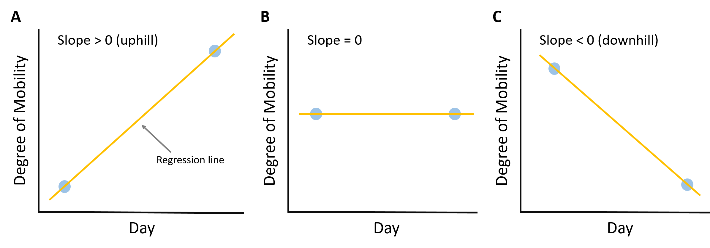
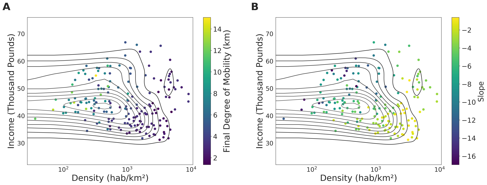
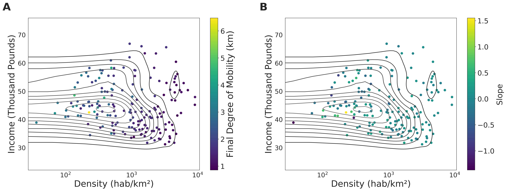
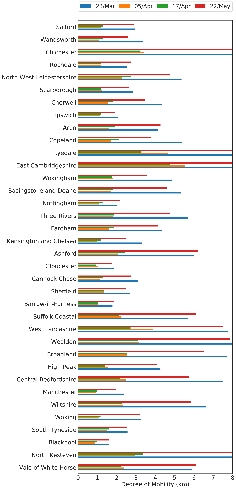
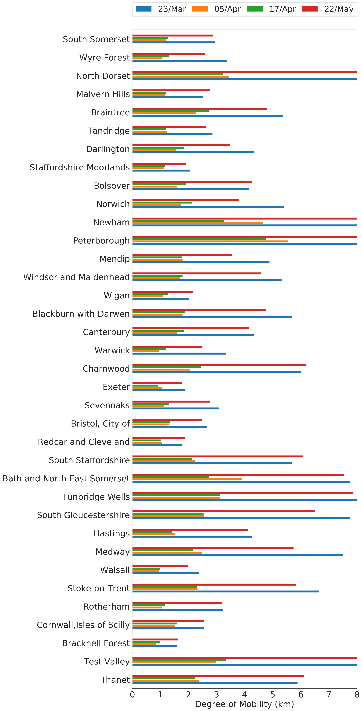
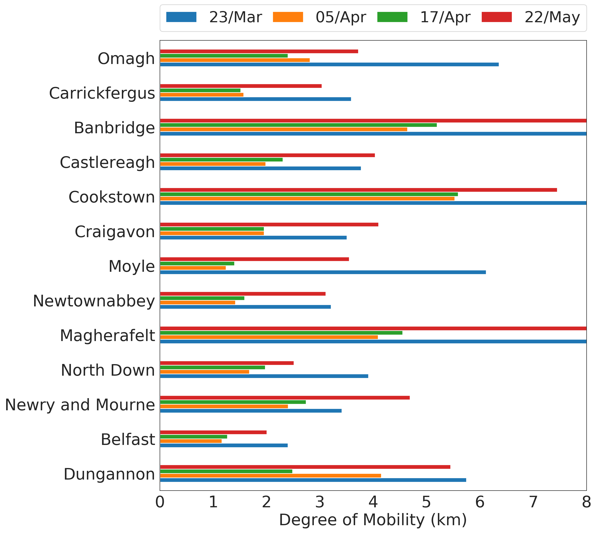

---

description: "Second report (13th May 2020): analysis of socioeconomic aspects related to mobility patterns in the UK during the COVID-19 pandemic"

---

Authors:
**Clodomir Santana (1), Federico Botta (1), Hugo Barbosa (1), Filippo Privitera (2), Ronaldo Menezes (1) and Riccardo Di Clemente (1).**

(1) Department of Computer Science, University of Exeter.
 
(2) Cuebiq Inc.

[Go back to home page](./index.html).
 
 
<a href="reports/Covid19_Second_UK.pdf" download>Click here to download the report.</a>

### Disclaimer

These results/analyses do not necessarily reflect the views of the University of Exeter and it is not an official position of the University. The analyses here reflect the personal views of the aforementioned researchers. The reader should also be aware that, although we have used all tools necessary to ensure the correctness of our analyses, this work has not been independently peer-reviewed. We welcome your feedback on our analyses and methodology.

## Executive summary

It is clear that lockdowns put in place around the world have affected people's lives at various levels. The debate about when they should start and end is endless with many defending variations of it which considers age, health risk, importance of the work for society (key workers), to name a few. [NEEED REFERENCE]. In certain locations in the world, particularly in developing nations, the debate is between health issues (lockdown) vs. survivebility (getting back to work); this debate is around health concerns and the economy and one that is hard to delve into. 

In line with the wories about the economy, a few world leaders have defended what is called <i>vertical</i> social isolation to "enable people in low income classes to earn a living" and "avoid further suffering from lost of income". [FIND QUOTES FROM TRUMP ET AL]. Although these policies have not been in place in the UK we explore what has been the <i>de facto</i> effect of lockdown policies to different social classes in the UK. 

### Summary of main findings

In this report, we show that low-income groups have never attained the same level of restrictions as high-income groups in the UK. This means that social isolation policies disproportionally affect different groups, with high-income groups being the most able to restrict their movement. We focused the analysis on three periods depicted in <b>Figure 1</b>, henceforth called P1 (from 11/3/2020 to 23/3/2020), P2 (from 23/3/2020 to 5/4/2020), and P3 (from 5/4/2020 to 17/4/2020). We kept the leght of the periods the same to ensure fairness in the analysis. We use these 3 periods to contrast the level of movement restriction for different social classes in a period before the announcement of the UK partial lockdown (P1), the period after the announcement until movement levels started to stabilize around the date of the historic broadcast from Queen Elizabeth II (P2), and the period after the broadcast until 17 of April (P3). We show that P3 shows an increase in the levels of mobility at for all classes which may be a sign of people getting tired of lockdown restrictions and venturing outside their homes. The increase in mobility in P3 varies significantly around the UK. Lastly, we show that normal rythms of individuals which arise of our daily routines are completely lost after the suggestion that people should avoid crowded places and work from home if possible (17/3/2020) (THIS DATE NEEDS TO BE CORRECTED IN THE FIGURE); this means that such measures lead to people having variety in their rythms or not having regular rythms themselves. 

### General Information and Methods

As indicated earlier this report focused on variations in human mobility as a function of socio-economics but also specific periods in the last couple of months of the pandemic. <b>Figure 1</b> gives us a general overview of mobility patterns for the entire UK. This general view demonstrates a clear change in patterns which we explored in our <a href="https://github.com/COVID19-UK-Mobility/COVID19-UK-Mobility.github.io/blob/master/First-report.md">First Report</a>. Yet, this figure also show us a stabilization in the mobility restrictions and perhaps even a slight increase in P3. However, the figure <i>does not</i> show how each different socio-economic groups compare to this general patterns, that is, do lockdown restrictions affect (or are implemented by) socio-economics groups differently?

 
<figure class="image" align="center">

<figcaption align="center"> <b>Figure 1</b> 
<i>Updated evolution of the mobility activity over time for the UK compared to the baseline (average mobility between 01 and 04 of February 2020). We divided the series into 3 periods: the first one (P1) is highlighted in blue and goes from 11 of March until the day where the partial lockdown was announced in the UK (23 of March). The second period (P2), represented in green, starts when the partial lockdown was announced and finished when the mobility activity levels begin to stabilize (05 of April). Finally, the last period (yellow region of the plot) is defined between 05 and 17 of April. In this last period, we noticed an increase in mobility activity in some regions of the UK. The important dates here are roughly the same ones used in Figure 5 in <a href="https://github.com/COVID19-UK-Mobility/COVID19-UK-Mobility.github.io/blob/master/First-report.md">First Report</a>. However, here we wanted to ensure the lengths of P1, P2 and P3 are the same.</i>
</figcaption>
</figure>

Coupled with <b>Figure 1</b>, we can with <b>Figure 2</b> see that in P3 all countries in the UK seen increases in mobility levels with the exception of Northern Ireland.

 
<figure class="image" align="center">

<figcaption align="center"> <b>Figure 2</b> 
<i>Comparison between the mobility levels on the end of the second period (05 of April) and the end of the third period (17 of April) in the UK, England, Nothern Ireland, Scotland and Wales. As observed, in most of the regions there was an increase in the mobility activity.</i>

</figcaption>
</figure>

 
<figure class="image" align="center">

<figcaption align="center"> <b>Figure 3</b> 
To estimate the direction and magnitude of the levels of degree of mobility in a period, the following approach was adopted: for each period, we used a linear regression model to find a line which connects the point that represents the degree of mobility in the start of the period to the point at the end of the period. The magnitude of the slope of this line will indicate how big was the difference while the sign tells if it was a reduction (negative) or an increase (positive) in the mobility levels. Figure 1 a shows a scenario of increasing mobility (slope > 0) and Figure 1 C depicts the opposite case (slope < 0). A slope value close to zero indicates small difference in the degree of mobility between the points considered.

</figcaption>
</figure>

### First Period: from 11 to 23 of March 2020

 
<figure class="image" align="center">

<figcaption align="center"> <b>Figure 4</b> 
Analysis of the impact that the population density (A) and annual income (B) of Local Authorities in England have on the slope of the line and the degree of mobility at the end of the period. The groups represented by the green and yellow colours were obtained with the division of the data into two equal-sized groups based on sample quantiles. The lines are the output of linear regression for its respective group (colour). These plots show that the reduction in mobility was greater in areas with low density and the ones with high income.

</figcaption>
</figure>

 
<figure class="image" align="center">

<figcaption align="center"> <b>Figure 5</b> 
In this analysis, we wanted to have a better understanding of how important the population density and the annual income are to the results achieved in terms of the slope and the final degree of mobility. The contours represent the bivariate kernel estimate of the data (https://seaborn.pydata.org/generated/seaborn.kdeplot.html). As can be seen, for the Final degree of mobility, the density attribute is can be relevant than the income (greater colour variation in the direction parallel to the x-axis). On the other hand, the slope of the curve is influenced by both the income and the density attributes (greater colour variation in the diagonal axis).

</figcaption>
</figure>

### Second Period: from 23 of March to 05 of April 2020

 
<figure class="image" align="center">

<figcaption align="center"> <b>Figure 6</b> 
In the second period assessed we observed similar results to the previous period where we can see a reduction in the degree of mobility in both groups of income and population density; however, it worth mentioning that, when compared to the first period, the slope and the final degree od mobility were smaller.

</figcaption>
</figure>

 
<figure class="image" align="center">

<figcaption align="center"> <b>Figure 7</b> 
The results depicted in this figure were similar to the ones in Figure 5 where the population density plays a major factor in the reduction of the final degree of mobility and both the density and the income influence the slope of the curve.

</figcaption>
</figure>

### Third Period: from 05 to 17 of April 2020

 
<figure class="image" align="center">

<figcaption align="center"> <b>Figure 8</b> 
Here we start to see the appearance of local authorities which have a positive slope of their line indicating an increase in the mobility degree in this period. Notice that this behaviour was observed in the income and population density groups.

</figcaption>
</figure>

 
<figure class="image" align="center">

<figcaption align="center"> <b>Figure 9</b> 
The colour patterns in this figure are also different from the one depicted in Figure 5 and Figure 7. We can no longer see a clear relationship between income/density and the results in terms of slope and final degree of mobility.

</figcaption>
</figure>

### Synchronisation of the Mobility Levels

 
<figure class="image" align="center">

<figcaption align="center"> <b>Figure 10</b> 

</figcaption>
</figure>

### Updated mobility trend in England
<figure class="image" align="center">

</figure>
<figure class="image" align="center">

</figure>
<figure class="image" align="center">

<figcaption align="center"></figcaption>
</figure>
 

### Updated mobility trend in Scotland
<figure class="image" align="center">

<figcaption align="center"> </figcaption>
</figure>
 

### Updated mobility trend in Norther Ireland
<figure class="image" align="center">

<figcaption align="center"> </figcaption>
</figure>
 

### Updated mobility trend in Wales
<figure class="image" align="center">

<figcaption align="center"></figcaption>
</figure>

## Data & Methods

This research has been performed using data from anonymized users who have opted-in to provide access to their location data anonymously, through a GDPR-compliant framework. The single users were not identifiable at any research steps. The residential areas were inferred at an aggregated local authority level. The analysis has been performed on a sample 250K users across the UK. We performed the radius of gyration analysis using the definition of (<a href="https://doi.org/10.1038/nature06958">Gonzalez, M. et al Nature 2008</a>). Moreover, each mobility value of a given region is the median value of the distribution of the radius of gyration of the users within a temporal window of 8 days centred around a given day.

## Team

<a href="http://emps.exeter.ac.uk/computer-science/"> University of Exeter, Department of Computer Science: </a> team members from the Department of Computer Science have expertise in human mobility, data science, human behaviour and urban science (see disclaimer above).

<a href="https://www.cuebiq.com/"> Cuebiq Inc.</a> is a consumer insights company that analyzes visitation patterns based on aggregated and privacy-enhanced mobility data, to provide measurement, support academic research and humanitarian initiatives.

## Contact us

If you have any questions, comments or would like to know more about our analysis, you can contact us at the following email addresses:
 
<a href = "mailto: r.di-clemente@exeter.ac.uk"> Riccardo Di Clemente</a>, Exeter University
 
<a href = "mailto: blake@cuebiq.com"> Brennan Lake</a>, Cuebiq Inc.

## Acknowledgments

This preliminary analysis is a collaboration between the Department of Computer Science of University of Exeter and Cuebiq Inc. In response to the COVID-19 crisis, <a href= "https://www.cuebiq.com/">Cuebiq</a> is providing insights to academic and humanitarian groups through a multi-stakeholder <a href="https://www.cuebiq.com/about/data-for-good/"> data collaborative</a> for timely and ethical analysis of aggregate human mobility patterns. We thank Pietro Gravino for the useful discussions.

 

When citing the content of this report, please cite as:
Clodomir Santana, Federico Botta, Hugo Barbosa, Filippo Privitera, Ronaldo Menezes, and Riccardo Di Clemenete (2020), Analysis of human mobility in the UK during the COVID-19 pandemic, https://covid19-uk-mobility.github.io/First-report

