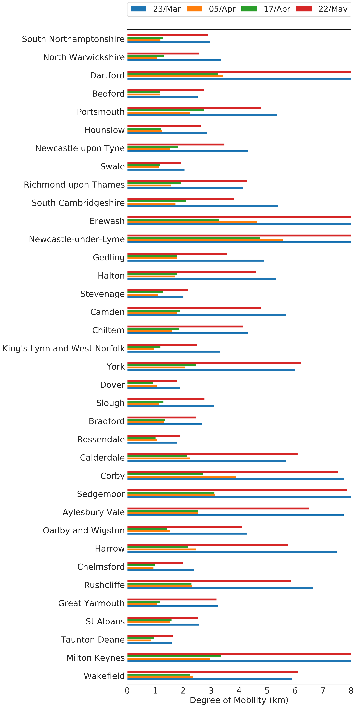
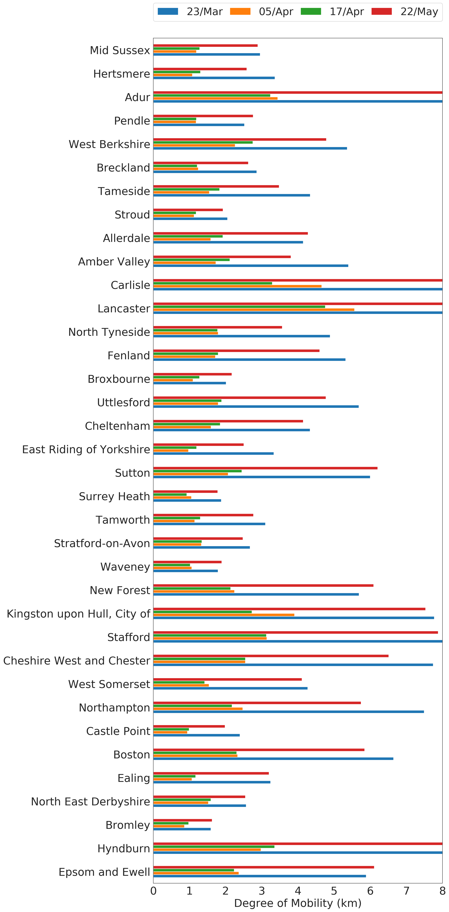
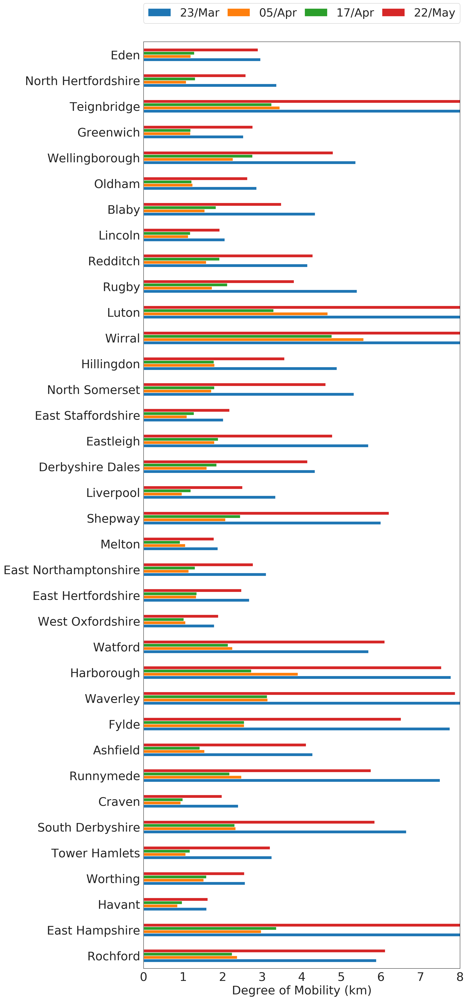
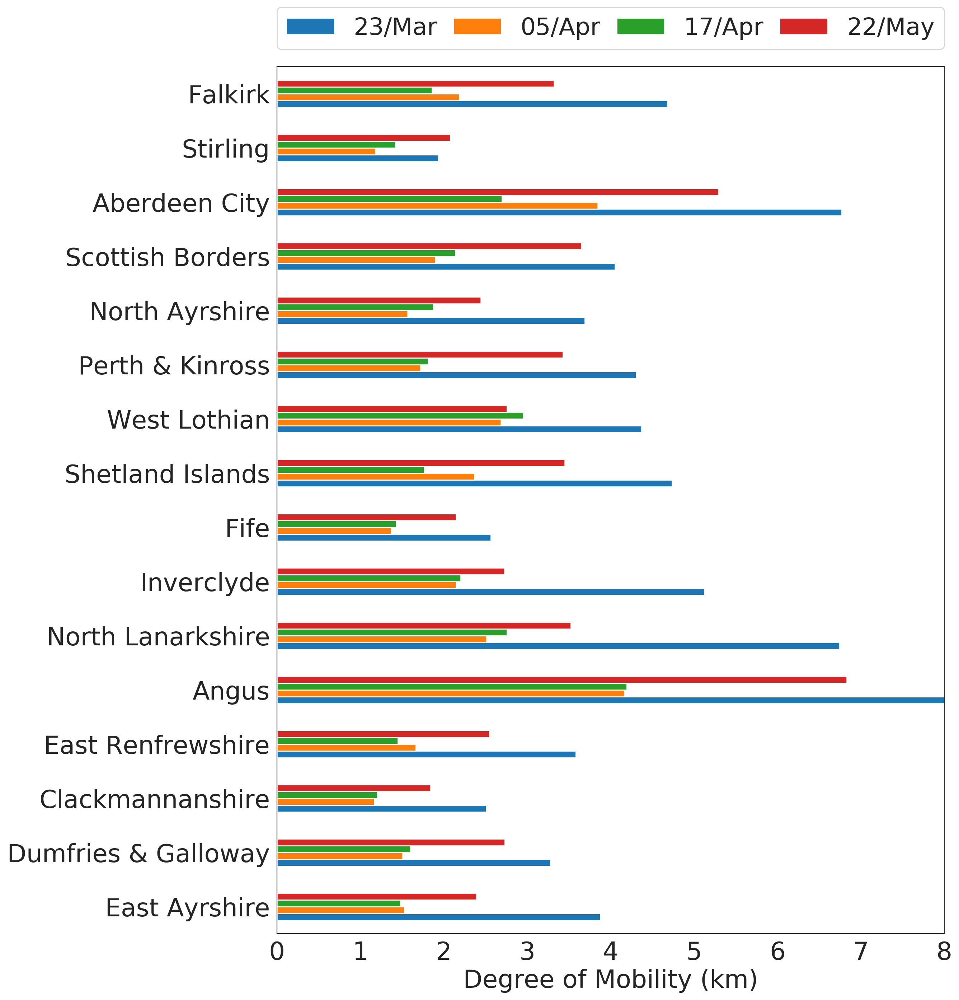
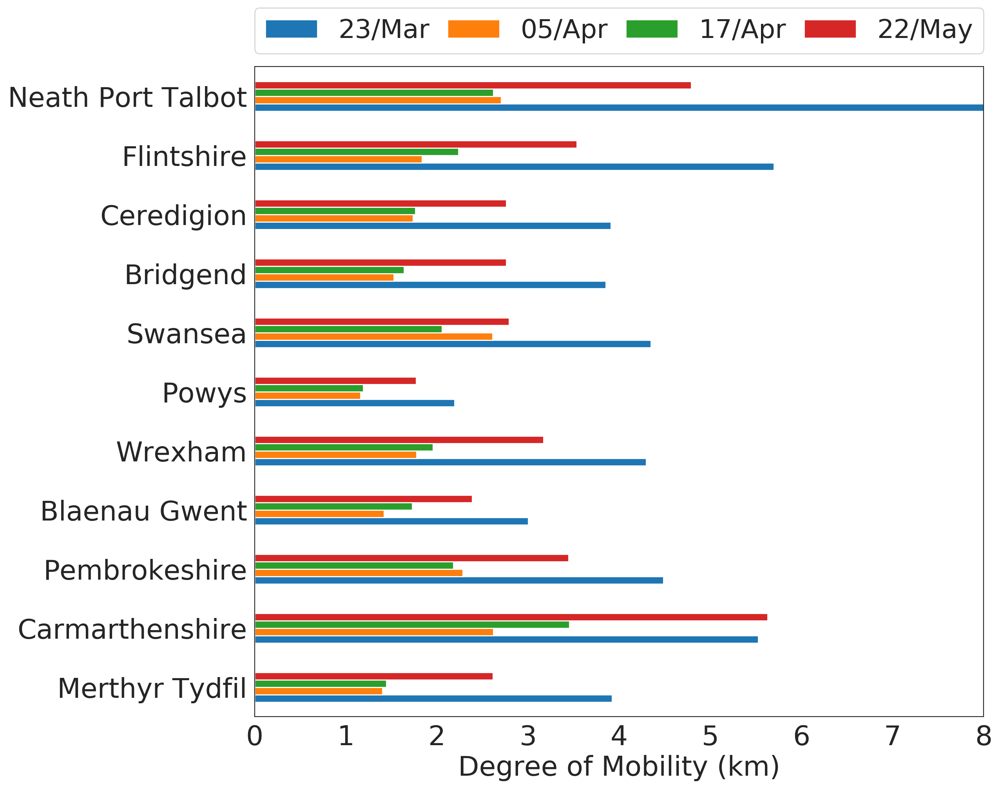

---

description: "Second report (13th May 2020): analysis of socioeconomic aspects related to mobility patterns in the UK during the COVID-19 pandemic"

---

Authors:
**Clodomir Santana (1), Federico Botta (1), Hugo Barbosa (1), Filippo Privitera (2), Ronaldo Menezes (1) and Riccardo Di Clemente (1).**

(1) Department of Computer Science, University of Exeter.
 
(2) Cuebiq Inc.

[Go back to home page](./index.html).
 
 
<a href="reports/Covid19_Second_UK.pdf" download>Click here to download the report.</a>

### Disclaimer

These results/analyses do not necessarily reflect the views of the University of Exeter and it is not an official position of the University. The analyses here reflect the personal views of the aforementioned researchers. The reader should also be aware that, although we have used all tools necessary to ensure the correctness of our analyses, this work has not been independently peer-reviewed. We welcome your feedback on our analyses and methodology.

## Executive summary

It is clear that lockdowns put in place around the world have affected people's lives at various levels. The debate about when they should start and end is endless with many defending variations of it which considers age, health risk, importance of the work for society (key workers), to name a few. [NEEED REFERENCE]. In certain locations in the world, particularly in developing nations, the debate is between health issues (lockdown) vs. survivebility (getting back to work); this debate is around health concerns and the economy and one that is hard to delve into. 

In line with the wories about the economy, a few world leaders have defended what is called <i>vertical</i> social isolation to "enable people in low income classes to earn a living" and "avoid further suffering from lost of income". [FIND QUOTES FROM TRUMP ET AL]. Although these policies have not been in place in the UK we explore what has been the <i>de facto</i> effect of lockdown policies to different social classes in the UK. 

#### Summary of main findings

In this report, we show that low-income groups have never attained the same level of restrictions as high-income groups in the UK. This means that social isolation policies disproportionally affect different groups with high-income groups being the most able to restrict their movement. 

 
<figure class="image" align="center">

<figcaption align="center"> <b>Figure 1</b> 
Example of three different scenarios for the slope.
</figcaption>
</figure>

 
<figure class="image" align="center">

<figcaption align="center"> <b>Figure 2</b> 
Example of three different scenarios for the slope.
</figcaption>
</figure>

 
<figure class="image" align="center">

<figcaption align="center"> <b>Figure 3</b> 
Example of three different scenarios for the slope.
</figcaption>
</figure>

### First Period: from 11 to 23 of March 2020

 
<figure class="image" align="center">

<figcaption align="center"> <b>Figure 4</b> 
Correlation between the slope of the curve and the income of the local authorities for the period between 23 or March and 05 of April 2020.
</figcaption>
</figure>

 
<figure class="image" align="center">

<figcaption align="center"> <b>Figure 5</b> 
Correlation between the slope of the curve and the income of the local authorities for the period between 11 and 23 of March 2020.
</figcaption>
</figure>

### Second Period: from 23 of March to 05 of April 2020

 
<figure class="image" align="center">

<figcaption align="center"> <b>Figure 6</b> 
Correlation between the slope of the curve and the income of the local authorities for the period between 23 or March and 05 of April 2020.
</figcaption>
</figure>

 
<figure class="image" align="center">

<figcaption align="center"> <b>Figure 7</b> 
Correlation between the slope of the curve and the income of the local authorities for the period between 11 and 23 of March 2020.
</figcaption>
</figure>

### Third Period: from 05 to 17 of April 2020

 
<figure class="image" align="center">

<figcaption align="center"> <b>Figure 8</b> 
Correlation between the slope of the curve and the income of the local authorities for the period between 23 or March and 05 of April 2020.
</figcaption>
</figure>

 
<figure class="image" align="center">

<figcaption align="center"> <b>Figure 9</b> 
Correlation between the slope of the curve and the income of the local authorities for the period between 11 and 23 of March 2020.
</figcaption>
</figure>

### Synchronisation of the Mobility Levels

 
<figure class="image" align="center">

<figcaption align="center"> <b>Figure 10</b> 
Correlation between the slope of the curve and the income of the local authorities for the period between 11 and 23 of March 2020.
</figcaption>
</figure>

### Updated mobility trend in England
<figure class="image" align="center">

</figure>
<figure class="image" align="center">

</figure>
<figure class="image" align="center">

<figcaption align="center"></figcaption>
</figure>
 

### Updated mobility trend in Scotland
<figure class="image" align="center">

<figcaption align="center"> </figcaption>
</figure>
 

### Updated mobility trend in Norther Ireland
<figure class="image" align="center">

<figcaption align="center"> </figcaption>
</figure>
 

### Updated mobility trend in Wales
<figure class="image" align="center">

<figcaption align="center"></figcaption>
</figure>

## Data & Methods

This research has been performed using data from anonymized users who have opted-in to provide access to their location data anonymously, through a GDPR-compliant framework. The single users were not identifiable at any research steps. The residential areas were inferred at an aggregated local authority level. The analysis has been performed on a sample 250K users across the UK. We performed the radius of gyration analysis using the definition of (<a href="https://doi.org/10.1038/nature06958">Gonzalez, M. et al Nature 2008</a>). Moreover, each mobility value of a given region is the median value of the distribution of the radius of gyration of the users within a temporal window of 8 days centred around a given day.

## Team

<a href="http://emps.exeter.ac.uk/computer-science/"> University of Exeter, Department of Computer Science: </a> team members from the Department of Computer Science have expertise in human mobility, data science, human behaviour and urban science (see disclaimer above).

<a href="https://www.cuebiq.com/"> Cuebiq Inc.</a> is a consumer insights company that analyzes visitation patterns based on aggregated and privacy-enhanced mobility data, to provide measurement, support academic research and humanitarian initiatives.

## Contact us

If you have any questions, comments or would like to know more about our analysis, you can contact us at the following email addresses:
 
<a href = "mailto: r.di-clemente@exeter.ac.uk"> Riccardo Di Clemente</a>, Exeter University
 
<a href = "mailto: blake@cuebiq.com"> Brennan Lake</a>, Cuebiq Inc.

## Acknowledgments

This preliminary analysis is a collaboration between the Department of Computer Science of University of Exeter and Cuebiq Inc. In response to the COVID-19 crisis, <a href= "https://www.cuebiq.com/">Cuebiq</a> is providing insights to academic and humanitarian groups through a multi-stakeholder <a href="https://www.cuebiq.com/about/data-for-good/"> data collaborative</a> for timely and ethical analysis of aggregate human mobility patterns. We thank Pietro Gravino for the useful discussions.

 

When citing the content of this report, please cite as:
Clodomir Santana, Federico Botta, Hugo Barbosa, Filippo Privitera, Ronaldo Menezes, and Riccardo Di Clemenete (2020), Analysis of human mobility in the UK during the COVID-19 pandemic, https://covid19-uk-mobility.github.io/First-report

