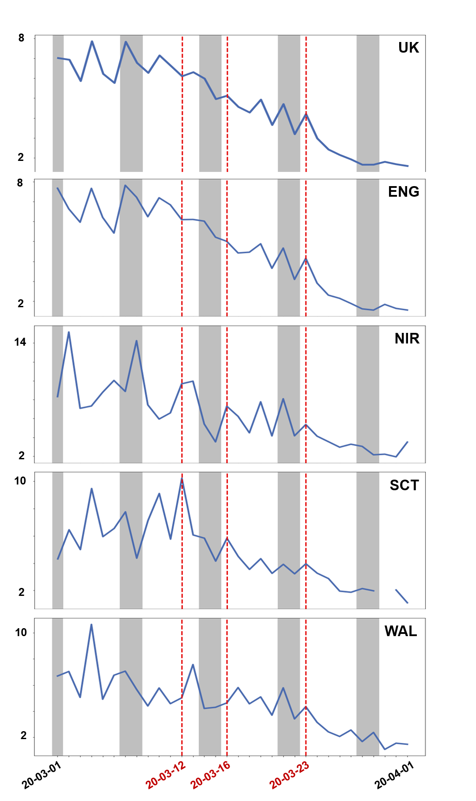
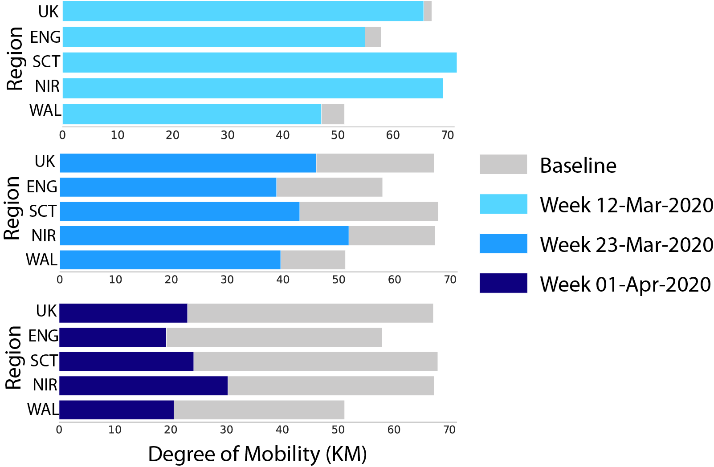
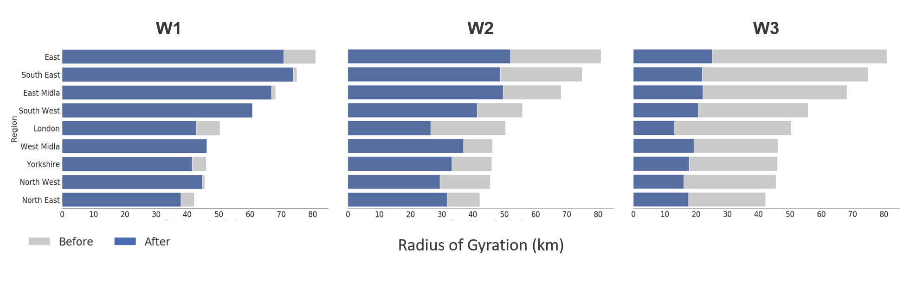

Authors:

#### <em> Clodomir Santana Jr.1, Federico Botta1, Hugo Barbossa1, Filippo Privitera2, Ronaldo Menezes1, Riccardo Di Clemente1</em>.

1 Exeter University, Department of Computer Science, Exeter, EX4 4QF, United Kingdom

2 Cuebiq Inc.
 
## General Information

As April 03rd the number of cases of COVID-19 reported in the UK were more than 33K counting more the 3.5K casualties. Europe and USA are now at the center of the pandemic. 
Folowing the lead of the countries that were the first to be impacted by the virus (China and Sounth Korea), countries around the world are limiting the people movements and implmenteing policy to foster the social distancing in order to containg the spreding of the virus.

A key indicator to evaluate the effectiveness of these restrictions and assess the compliance of the population is the reduction in mobility. Here, we will use a large, national-scale data set on human mobility, provided by the collaboration with Cuebiq, to evaluate the adherence to these measures by the general population.

This report has been based on similar analysis carried on Italian data 
<a href="https://doi.org/10.1101/2020.03.22.20039933"> Pepe E. et al. 2020 </a>  and USA data
 <a href="https://www.mobs-lab.org/uploads/6/7/8/7/6787877/assessing_mobility_changes_in_the_united_states_during_the_covid_19_outbreak.pdf"> Klein B. et al. 2020 k</a>. We aim to provide and assement on the changes in commuting and mobility at county level across UK during the Covid-19 health crisis.
 
 Some infos on the results:
 
 

## Timeline of COVID-19 development in the UK
In January 2020, cases of the novel coronavirus started being reported outside of China. These cases were typically from people who had recently travelled to the Chinese Hubei province, where the disease started spreading. Events related to COVID-19 in the UK started unfolding at the end of January, with the first reported cases in the country. A brief timeline for the UK is the following:
   * <b>31st January 2020</b>: two Chinese nationals, one of whom studied at the University of York, were the first confirmed cases in the UK.
   * <b>6th February 2020</b>: a man in Brighton became the third confirmed case in the UK. He had previously travelled to Singapore and then visited a ski resort in France.
   * <b>10th February 2020</b>: the number of confirmed cases in the UK increases to 10, due to infections linked to the man in Brighton.
   * <b>27th February 2020</b>: the total number of confirmed cases is 16, with the first signs of infections spreading from the outbreak in Northern Italy due to people travelling back from the affected regions.
   * <b>1st March 2020</b>: the official number of cases is 36, and there are signs of infections amongst people with no history of recent travel abroad.
   * <b>11th March 2020</b>: the confirmed cases in the UK are now 456. The World Health Organisation declares the outbreak a pandemic.
   * <b>12th March 2020</b>: the UK Chief Medical Office raises the risk from moderate to high. Anyone with a new continuous cough or a fever is recommended to self-isolate for seven days, schools cancel trips abroad and people over 70 are asked to avoid cruises.
   * <b>13th March 2020</b>: many sporting events are postponed, as well as the 2020 UK local elections.
   * <b>16th March 2020</b>: the number of cases is over 1,500, and the number of deaths is 55. The Prime Minister advises against non essential travelling, and encourages people to avoid pubs, clubs and theatres. Working from home is encouraged.
   * <b>23rd March 2020</b>: the Prime Minister announces stricter measures for the UK. People are asked to stay home except for essential food shopping, essential work travel and one form of exercise per day only with members of their household.
   * <b>26th March 2020</b>: the death toll is 422, and the number of people that tested positive is 11,568.
   * <b>27th March 2020</b>: both the Prime Minister and the Health Secretary announce testing positive for the virus.

Note that this timeline is not meant to be complete, but is only an indication of how major events related to COVID-19 unfolded in the UK over time, and which restrictions were put into place at what point in time. For a more complete report on the development of COVID-19 in the UK, you can <a href="https://en.wikipedia.org/wiki/2020_coronavirus_pandemic_in_the_United_Kingdom" target = "_blank" rel = "no opener no referrer">read more here</a>. 

## Results

We are assesing the citizen mobility pattern using ..
Add a lay description of the radius of gyration.

## The Analysis

### Baseline Jannuary 2020

To establish a baseline for comparison, we combined the average mobility patterns of days period used was from 7 to 23 of January of 2020. This period was before the spread of the COVID-19 in the UK and do not contains holidays of other events which could affect the mobility of people. The baseline is the median of the radius of gyration of places in the UK in the period specified and it is depicted in <b>Figure 1 (A)</b>. As an example of a comparison between the baseline and another day, we selected the 25th of February and showed the comparison result in <b>Figure 1 (B)</b>. As can be noticed in this figure, in that day the radius increased or not changed in the majority of the regions of the Uk.

 

&nbsp&nbsp&nbsp

 <b>Figure 1.</b> (A) Representation of the radius of gyration of the baseline in a logarithmic scale where the reddish is the colour the means greater is the radius. (B) Comparison of the baseline to the 25th of February. The blue areas represent spaces where the radius of gyration decreased, while in grey areas the radius increased or not changed when compared to the baseline.

### 12th March 2020

The number of confirmed cases in the UK was around five hundred by the 12th of March and the Chief of the Medical Office advised cancel school trips and recommend people with symptoms (fever of dry continuous cough) to self isolate for seven days. <b>Figure 2</b> illustrates the comparison between this day and the baseline. As can be noticed, we can see a rise in the number of regions whose radius of gyration decreased (when compared to the 25th of February). However, we still have an elevated number of places where the mobility was not affected or even increased.
 

 <b>Figure 2.</b> Comparison between the baseline and the 12th of March 2020.

### 23 March 2020

In the 23thd of March, the UK registered more than 6500 confirmed cases of COVID-19 and over 300 deaths. <b>Figure 3</b> shows the changes in the radius of gyration on this date. As illustrated by this figure, differently to the other two scenarios, now we can observe a reduction of the radios in almost all the regions of the UK. This can be related to the measures announced to slow down the transmission of the virus. One of these measures was the recommendation of working from home which could lead to a reduction in the mobility patterns of the population observed.
 

<b>Figure 3.</b> Comparison between the radius of gyration of areas in the UK on the 23thd of March 2020 and the baseline.

maps of uk and comments

### 01 April 2020

<Figure 4> shows the UK scenario on the 01st of April 2020. In this date, the total number of confirmed cases was 29.474 with 2352 deaths and, as can be observed in the map, a similar situation to the 23thd is depicted where most of the areas present a reduction on the radius of gyration.

 

<b>Figure 4.</b> Comparison between the radius of gyration of areas in the UK on the 01st of April 2020 and the baseline.

### The Trend of UK

 

image on the general trend ENG, SCO, WALL, NI with the time line we proposed.

### Comparison Mobility Before and After Mobility Restrictions

 

 

 

 

 

### Remarks

Comments on the resulsta

### Validation of Data

Population plot

## Data

This research has been performed on data from anonymized users who have opted-in to provide access to their location data anonymously, through a GDPR-compliant framework. The single users were no identifiable at any research steps. The residencial areas were inferred at an aggregated county level.

## Team

<a href="http://emps.exeter.ac.uk/computer-science/"> University of Exeter, Department of Computer Science </a>, work closely with other disciplines on a wide range of projects and enjoy a fruitful relationship with a variety of business partners, collaborating on diverse projects that encompass engineering, IT, telecoms, water, aviation and biosciences. 

 
<a href="https://www.cuebiq.com/"> Cuebiq Inc.</a> is a consumer insights company that analyzes visitation patterns based on aggregated and privacy-safe mobility data, to provide measurement, support academic research and humanitarian initiatives. 

## Acknowledgments
This preliminary analysis is a collaboration between the Department of Computer Science of Universtiy of Exeter and Cuebiq Inc. In response to the COVID-19 crisis, <a href= "https://www.cuebiq.com/">Cuebiq</a> is providing insights to academic and humanitarian groups through a multi-stakeholder <a href="https://www.cuebiq.com/about/data-for-good/"> data collaborative</a> for timely and ethical analysis of aggregate human mobility patterns. We thank Pietro Gravino for the usefull discussions.
